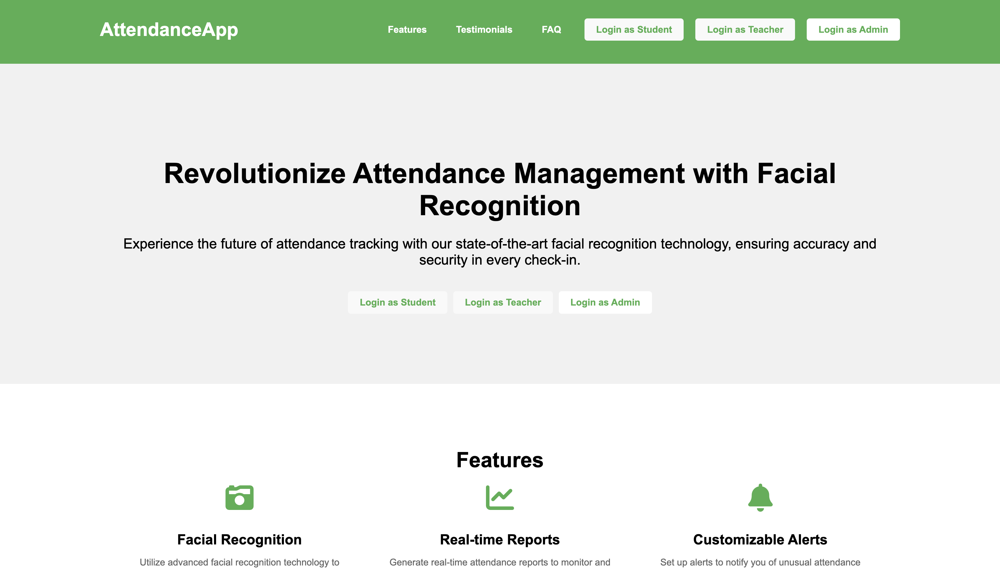
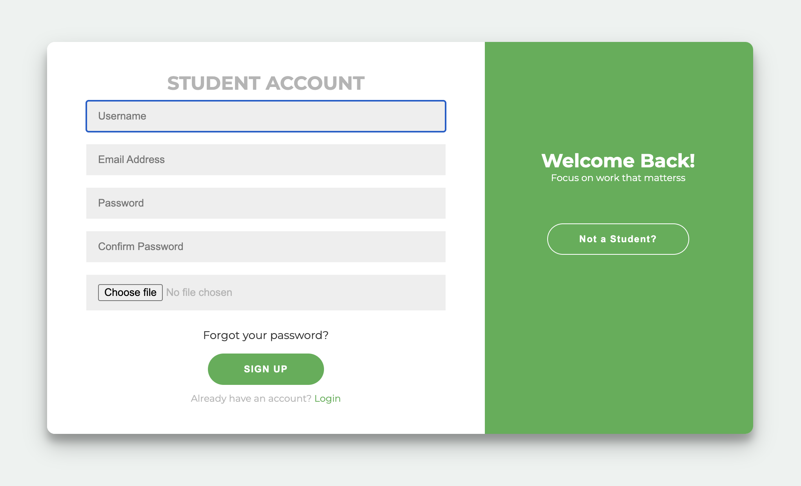
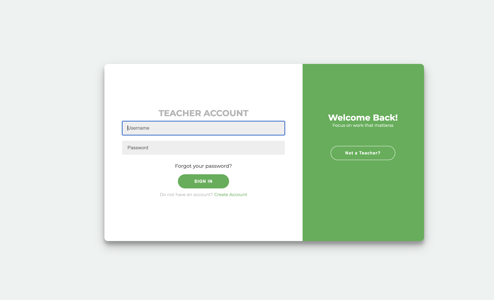
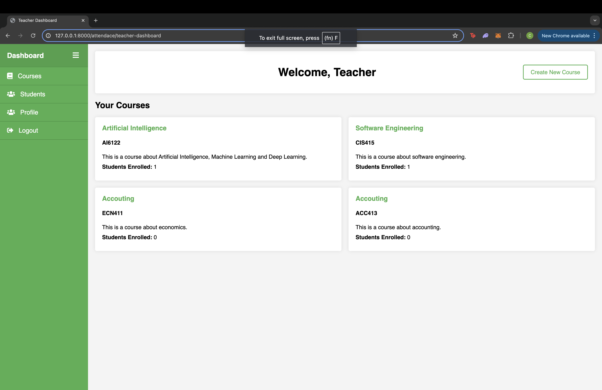
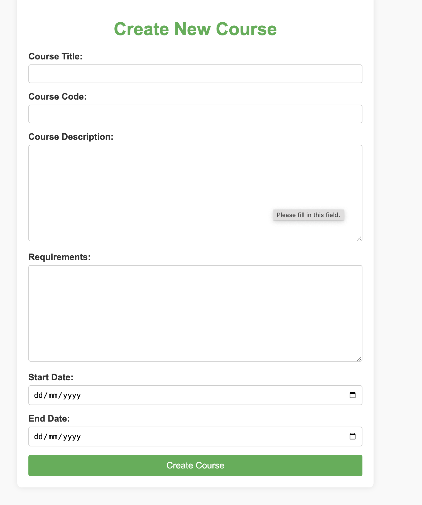

# Smart Face Recognition Attendance System 🎯

## Overview
An intelligent attendance tracking system that leverages facial recognition technology to automate the attendance marking process. The system provides a seamless experience for both teachers and students while ensuring accurate attendance records.

## 🔍 Problem Statement
Traditional attendance tracking methods are:
- Time-consuming
- Prone to errors
- Vulnerable to proxy attendance
- Difficult to maintain and analyze

Our system solves these challenges through automation and advanced facial recognition technology.

## 💻 Tech Stack
- **Backend Framework**: Django
- **Frontend**: HTML, CSS, JavaScript
- **Face Recognition**: CNN (Convolutional Neural Network)
- **AJAX**: For real-time processing
- **Database**: SQLite/PostgreSQL
- **Face Processing Library**: face_recognition

## 🚀 Features
- Real-time face detection and recognition
- Separate authentication for students and teachers
- Automated attendance marking
- Attendance reports and analytics
- User-friendly interface
- Proxy-proof attendance system

## 🔨 Development Stages
1. **UI Development**
   - Created responsive user interfaces
   - Implemented Django templates
   - Mobile-friendly design

2. **Authentication System**
   - Separate authentication for teachers and students
   - Secure login/logout functionality
   - Role-based access control

3. **Face Recognition Implementation**
   - Integration of face_recognition library
   - Model training and optimization
   - Real-time processing capabilities

4. **Testing & Optimization**
   - Performance testing under various conditions
   - Security testing
   - Load testing and optimization

## 📝 Installation

```bash
# Clone the repository
git clone [repository-url]

# Navigate to project directory
cd face-recognition-attendance

# Create virtual environment
python -m venv venv

# Activate virtual environment
source venv/bin/activate  # For Unix
venv\Scripts\activate     # For Windows

# Install dependencies
pip install -r requirements.txt

# Run migrations
python manage.py migrate

# Start the server
python manage.py runserver
```

## 📸 Screenshots
<details>
<summary>Click to view screenshots</summary>


*Landing Page view*


*Signup interface for students*


*Login interface for teachers*


*Dashboard interface for teachers*


*Login interface for users*


*Real-time attendance marking interface*


</details>

## 🎥 Demo
Watch the system in action: [Video Demo](https://drive.google.com/file/d/1yBry3-pdASnnLViKi-QornvI2Z5mDlMc/view)

## 💼 Usage
1. **Teacher Interface**
   - Register new students
   - Start attendance sessions
   - View attendance reports
   - Manage student data

2. **Student Interface**
   - Mark attendance through facial recognition
   - View personal attendance records
   - Update profile information

## 🔐 Security Features
- Encrypted data storage
- Secure authentication
- Protected against common web vulnerabilities
- Regular security updates

## 🤝 Contributing
1. Fork the repository
2. Create your feature branch (`git checkout -b feature/AmazingFeature`)
3. Commit your changes (`git commit -m 'Add some AmazingFeature'`)
4. Push to the branch (`git push origin feature/AmazingFeature`)
5. Open a Pull Request


## 👥 Contact
- GitHub: [Your GitHub Profile](https://lnkd.in/gw2XgxJf)
- Email: [Your Email](onwuchulubachidubem@gmail.com)
- LinkedIn: [Your LinkedIn Profile](https://www.linkedin.com/in/chidubem-onwuchuluba-787414227/)

## 🙏 Acknowledgments
- List any third-party libraries/tools used
- Credits to contributors
- Mention any inspiration sources

---

